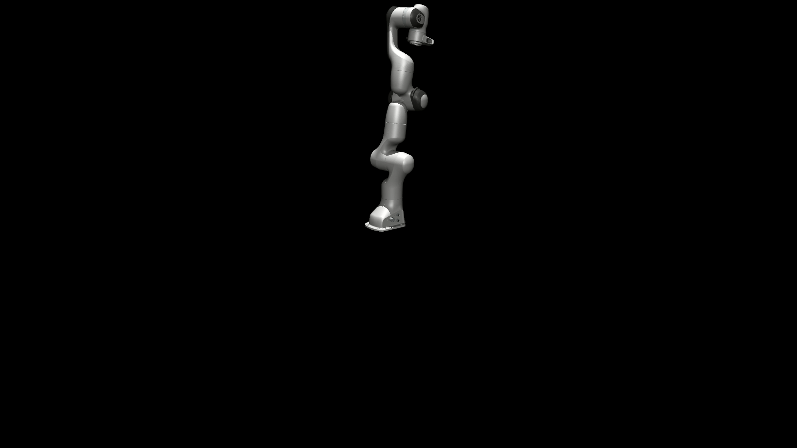
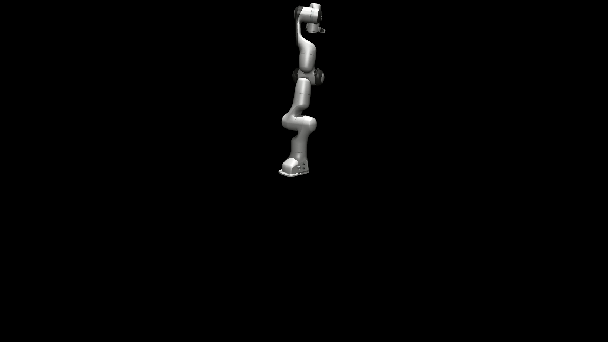

# mujoco-franka-demo

<p align="center">English | <a href="./README_cn.md">中文</a><br></p>

## Python Version

### Dependencies

```bash
pip install mujoco
```

### Run

```bash
python forward_kinematics.py
python inverse_kinematics.py
```

## C++ Version

### Dependencies

1. Install MuJoCo https://github.com/google-deepmind/mujoco
2. Install glfw 
```bash
sudo apt-get install libglew-dev
```
3. Install Eigen3
```bash
sudo apt-get install libeigen3-dev
```

### Compile

```bash
mkdir build && cd build
cmake ..
make
```

### Run

```bash
./forward_kinematics
./inverse_kinematics
```

## Results

### inverse_kinematics



### forward_kinematics



## TODO

The C++ version uses a custom rendering implementation which takes longer to render than the Python version. Even when using `glfwSwapInterval(0)` to disable vertical sync, rendering still takes longer than in the Python version which uses `mujoco.viewer`. It would be worth investigating the rendering process of `mujoco.viewer` when possible.

## License

This project is licensed under the MIT License. See the [LICENSE](./LICENSE) file for details.


### Third-party Components

This project includes the following third-party components licensed under the Apache License 2.0:

- **Franka Emika Panda model** - The model files in the `model/franka_emika_panda/` directory are licensed under Apache License 2.0. The original license file is retained in that directory.
