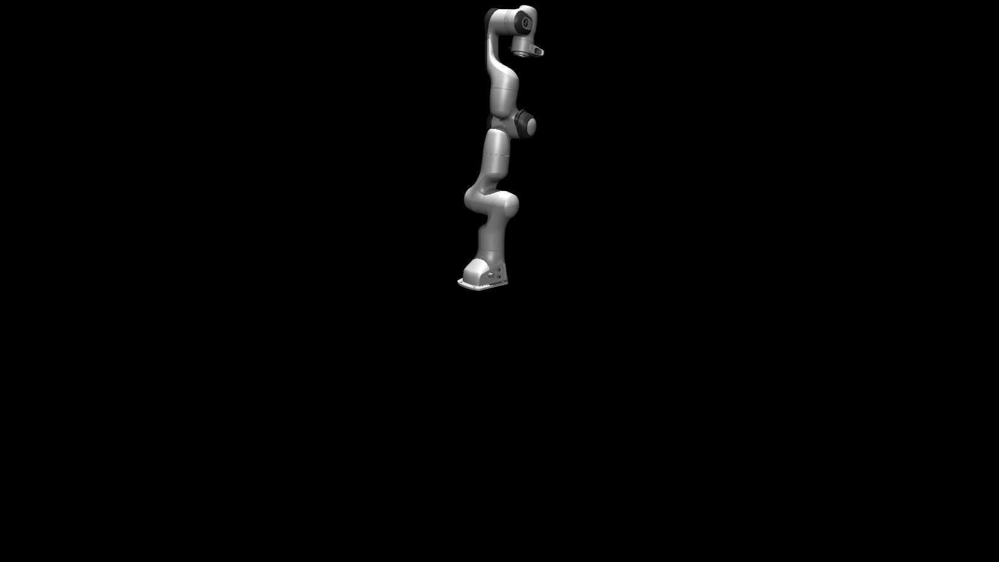
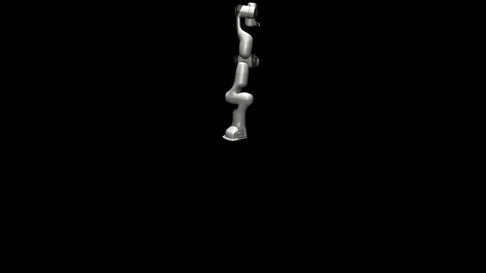

# mujoco-franka-demo

<p align="center">中文 | <a href="./README.md">English</a><br></p>

## Python版本

### 安装依赖

```bash
pip install mujoco
```

### 运行

```bash
python forward_kinematics.py
python inverse_kinematics.py
```

## Cpp版本

### 安装依赖

1. 安装MuJoCo https://github.com/google-deepmind/mujoco
2. 安装glfw 
```bash
sudo apt-get install libglew-dev
```
3. 安装Eigen3
```bash
sudo apt-get install libeigen3-dev
```

### 编译

```bash
mkdir build && cd build
cmake ..
make
```

### 运行

```bash
./forward_kinematics
./inverse_kinematics
```

## 运行结果

### inverse_kinematics



### forward_kinematics



## TODO

Cpp版本由于渲染部分是自己写的，渲染耗时较长，及时使用`glfwSwapInterval(0)`禁止垂直同步，渲染耗时也比Python版本使用`mujoco.viewer`渲染耗时更长，有机会值得研究一下`mujoco.viewer`的渲染过程。

## 许可证

本项目采用MIT许可证。详情请见[LICENSE](./LICENSE)文件。


### 第三方组件

本项目包含以下使用Apache License 2.0许可的第三方组件：

- **Franka Emika Panda模型** - 位于`model/franka_emika_panda/`目录下的模型文件采用Apache License 2.0许可。原始许可证文件保留在该目录中。
